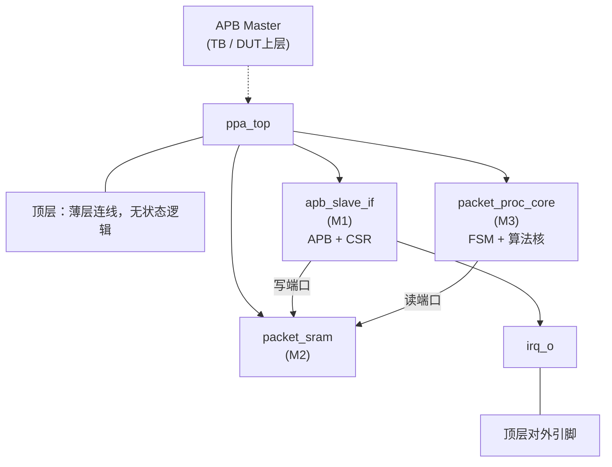

<!-- 数字纪律：README 的成果数字只落在两处——① <!-- GEN:key -->…<!-- /GEN:key --> 生成区
     （make report-sync 注入）；② 徽章行的 data-metric 占位 span（值由 report.py 现算，make report-check 校验）。
     其余为叙事，手写。改数据 = 改真值源后跑 make report-sync + make report-check。 -->
# ppa-lite-copilot

**PPA-Lite** —— APB 3.0 从机挂载的单帧包处理加速器：SystemVerilog RTL + UVM-1.2 验证 + 脚本驱动的多 Agent（ARCH/DE/DV/REV 角色分离、证据链驱动、低 token 记忆系统）工作流。

**v<span data-metric="project.version">0.5.5</span>** · **M1–M4 全部收官** · 回归 <span data-metric="results.regress.latest.text">32/32</span> · 六类综合覆盖率 <span data-metric="results.coverage.latest.score">97.46</span>% · 单一事实源 `doc/spec.md`

## 成果速览

<!-- GEN:readme-kpi -->
| 指标 | 数值 | 出处 |
| --- | --- | --- |
| 六类综合覆盖率 | 97.46% | `doc/evidence/v0.4.0/coverage-summary.md` |
| 最新回归通过 | 32/32 | `doc/evidence/v0.4.0/result_summary.txt, doc/evidence/v0.4.1/result_summary.txt` |
| testplan 场景 | 31 ✅ | `doc/testplan.md` |
| SVA 断言 | 49 条 | `rtl/ + tb/sva/` |
| RTL 代码 | 939 行 | `rtl/*.sv` |
| TB 代码 | 3514 行 | `tb/**/*.sv` |
| 缺陷闭环 | 18 条 | `doc/bugs.md + doc/bugs-archive.md` |
| lint 豁免 | 12 条 | `doc/lint-waivers.md + 归档` |
| rev 审查记录 | 13 份 | `doc/evidence/v*/rev-*.md + review*.md` |
| spec 修订 | 11 次 | `doc/spec.md` |
<!-- /GEN:readme-kpi -->

> 每个数字都由 `scripts/report.py` 从真值源现算，`make report-check` 静态比对，禁止手写。

## 全景页

一页看懂设计 / 验证 / 结果 / 复现 + 五类内联 SVG 图表 + 诚实专栏：**[`doc/report.html`](doc/report.html)**（自包含、深浅双主题、零外部依赖）。
GitHub 不渲染仓库内 HTML，需 `git clone` 后用浏览器打开。

## 架构（spec §2.1）

`ppa_top` = 薄层连线，统一分发 `PCLK/PRESETn`；`irq_o` 为唯一顶层对外引脚（`done_o` 为内部信号，不引出，r11）。



> 注：spec 里的 M1/M2/M3 是**模块实例编号**；本仓库的 M1–M4 是**里程碑编号**（M1=Lab1…M4=Lab4）。两套体系勿混。

## 快速开始

```bash
git config core.hooksPath .githooks   # 首次克隆后启用文档软门禁

make handover      # 接手：版本 + 状态 + 最新日志块 + testplan/缺陷统计
make next          # 机械推导下一步行动清单
make smoke         # 冒烟测试（需本地 VCS）
make run TEST=ppa_smoke_test SEED=42 FSDB=1
make regress       # 一键回归 → sim/result_summary.txt
make cov           # urg 覆盖率报告
make docs-check    # 文档结构 + 证据链守卫（pre-commit/CI 同款）

make report        # 成果数据速查（人读）
make report-sync   # 把现算数据注入 doc/report.html / README.md 的生成区
make report-check  # 七项校验：生成区新鲜度 + 静态数字比对 + 源码注释⇄交付状态 等
```

## 目录

```
doc/          spec.md（单一事实源）、记忆系统（status.jsonl/log.md/testplan.md）、
              bugs.md、feature-matrix.md、lint-waivers.md、design-prompt/、evidence/、
              report.html（单页全景）、presentation/（答辩讲稿，规划中）
rtl/          RTL（按模块组织；含 DE 的内部不变量断言）
tb/           UVM 环境（一类一文件：apb_agent / core_agent / env / test）+ sva/（DV 接口断言 bind）
sim/          VCS Makefile、filelist、regress/regress.list
scripts/      docs.py（handover/check/archive）、bump.py、regress.py、evidence.py、
              report.py（成果数据机械抽取层 + 生成区注入 + 静态数字校验）
.claude/      agents（arch/de/dv/rev）与 skills（handover/dispatch/evidence/closeout）
```

## 里程碑与版本

版本 `0.M.P`（`version.json`）：M 对应 spec 的 Lab1–4，P 为里程碑内迭代；选做项按必做对待。
M 完成 = feature-matrix 关联场景全 ✅ + `make regress` 100% PASS 证据 + rev 审查记录，然后 `make bump-minor` + 打 tag `v0.M.P`。

<!-- GEN:readme-milestones -->
| 里程碑 | Lab | 模块 | 场景 | 回归 | 六类综合 | 签核记录 |
| --- | --- | --- | --- | --- | --- | --- |
| M1 | Lab1 | apb_slave_if、packet_sram | 9/9 ✅ | 10/10 | N/A（M1 模块聚合域 (mod5+mod7)，该版本无 SCORE 行） | `doc/evidence/v0.1.6/rev-review-M1.md` |
| M2 | Lab2 | packet_proc_core | 7/7 ✅ | 17/17 | 86.16 | `doc/evidence/v0.2.3/review-m2-milestone.md` |
| M3 | Lab3 | ppa_top | 5/5 ✅ | 22/22 | 82.05 | `doc/evidence/v0.3.0/review-m3-milestone.md` |
| M4 | Lab4 | (全系统) | 10/10 ✅ | 32/32 | 97.46 | `doc/evidence/v0.4.1/review-m4-milestone.md` |
<!-- /GEN:readme-milestones -->

## 核心纪律

厚存储 · 薄读口，机械交脚本 · 语义留 Agent，单一事实源 + 文档守卫。
**没有仿真 log 就没有 ✅**——testplan/bugs 的每个通过项都必须指向 `doc/evidence/` 下带复现命令（TEST+SEED）的证据文件，由 `make docs-check` 机械校验。
实例隔离（同模块 DE≠DV、arch≠rev）切断共模错误传播；对外可见行为一律进 spec，design-prompt 只准约束实现。

## 诚实边界

- **断言曾经不拦回归**（BUG-014）：过去 4 个里程碑期间断言对回归的拦截力实际为 0，已修复（现在断言失败会让回归变红），但历史清白是**事后复算**出来的，不是当时流程保障的。
- **功能覆盖率轻量**：仅 1 个 covergroup；六类综合覆盖率是**代码域水位**，不代表功能空间覆盖。
- **lint 未清零**：`make lint` 至今 `exit 1`；现 <span data-metric="results.waivers.sites_total">81</span> 处告警 / <span data-metric="results.waivers.total">12</span> 条豁免全部经 rev 复核（不写「lint 干净/清零」）。
- **记分板非集中式**、无 RAL / virtual sequence / factory override、约束随机非工业级 CRV。

以上每条的「现状 → 替代方案 → 代价」详版见 [`doc/report.html`](doc/report.html) 的诚实专栏。

## 延伸阅读

- `doc/spec.md` —— 单一事实源（原件存档于 commit `b542407`）
- `doc/testplan.md` —— 场景真值表 · `doc/feature-matrix.md` —— 功能分解
- `doc/evidence/` —— 仿真 log / 回归摘要 / 覆盖率摘录 / rev 审查记录
- `doc/report.html` —— 单页全景 · `doc/presentation/` —— 答辩讲稿（规划中）
- `CLAUDE.md` —— 工作流总纲（角色/调度/记忆系统/门禁）
